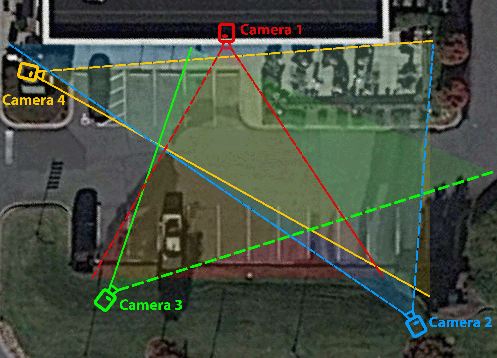

# CHAD: Charlotte Anomaly Dataset

[](https://arxiv.org/abs/2212.09258)


CHAD is high-resolution, multi-camera dataset for surveillance video anomaly detection. It includes bounding box, Re-ID, and pose annotations, as well as frame-level anomaly labels, dividing all frames into two groups of anomalous or normal. You can find the paper in the following link: [**CHAD: Charlotte Anomaly Dataset**](https://arxiv.org/abs/2212.09258 "CHAD Paper").

<p align="center">
  
</p>
<p align="center">
  CHAD cameras' point-of-view
</p>

<p align="center">
  
</p>
<p align="center">
  CHAD cameras' positions
</p>


<!--  -->

The list of the anomalous behaviors are as follow:

| Group Activities | Individual Activities |
| --- | --- |
| Fighting | Throwing |
| Punching | Riding |
| Kicking | Littering |
| Pushing | Hopping |
| Pulling | Running |
| Slapping | Falling |
| Strangling | Jumping |
| Body Hitting | Sleeping |
| Theft | |
| Pick-Pocketing | |
| Tripping | |
| Playing with Ball | 
| Chasing | |
| Playing with Racket | |

Any other behavior is counted as normal.

We have used 4 cameras to record videos from a parkinglot. The first three are Full-HD and the forth camera is HD. 

For detailed infomration please refer to the paper.

## How to Download The Dataset

For downloading the videos, please use the following link:

[**CHAD_Videos**](https://drive.google.com/file/d/13am4hfhicErcozAYgkmQm02_K-cCmtkQ/view?usp=sharing "CHAD_Vidoes")

For downloading the annotations, anomaly labels, and splits, please use the following link:

[**CHAD_Meta**](https://drive.google.com/file/d/1g01Ay86cuPmKGsrfxddxwA1uG_7bFFmu/view?usp=sharing "CHAD_Meta")

The directory of the entire dataset has following simple structure:

```
CHAD/
├── CHAD_Videos
├── CHAD_Meta
    ├── annotations
    ├── anomaly_labels
    ├── splits
```

## Structure of Videos

CHAD consists of 412 separate high-quality videos adding up to approximately 1.15M frames, out of which 1,09M frames are normal, and 59K are anomalous. 

There are four different point of views, recorded by 4 cameras simoltanously from the same scene and you can identify them by looking at the videos or using the name of each file. 

The naming of the files has the following pattern:

```
<camera_number>_<video_number>_<existance_of_anomalous_frame>.mp4
```

Camera number can be 1,2,3,or 4. 

Video number is the number of the video from the specific camera. 

The existance of anomalous frames identifies if something anomalous happens in the video or not. If it is 1, it means the video contains anomalous behaviour, and if it is zero it means the video only includes normal frames.

_--Please note that <existance_of_anomalous_frame> only indicates whether a video has anomalous frames or not. You can use **anomaly_labels** for frame level labels for anomaly.--_

## Structure of Annotations

Each video has its own dedicated annotation file in .pkl format. 

This means that there are also 412 annotations available, each contating the person ID, bounding box, and keypoints per frame. 

The files follow the same naming pattern as the videos, and it has a dictionary with the following format:

```python
{
  "Frame_number": 
  {
    "Person_ID": array([[Boudning_Box], [Keypoints]])
  }
}
```

You can use the following code snippet to read the pickle files:

```python
import pickle

# Open the pickle file for reading
with open('CHAD/annotations/file.pickle', 'rb') as f:
    # Load the contents of the file into a dictionary
    my_dict = pickle.load(f)

# Print the dictionary to verify that it has been loaded correctly
print(my_dict)
```

## Structure of Anomaly Labels

Anomaly labels are in .npy format.

They exactly follow the same naming pattern, and we have one file per each video. 

Each file is an array of 0s and 1s with the length of the number of frames in each video. 0 means the frame is normal, and 1 means the frame is anomalous.

You can use the following code snnipet to load the files:

```python
import numpy as np

# Load the .npy file
data = np.load('file.npy')

# Print to see the data
print(data)

```

## Structure of The Splits

There are two different splits for CHAD.

 In the first split, training set only contains normal frames and the test set has both anomalous and normal frames. This can be specially useful for unsupervised learning.
 
 In the second split, both training and testing sets contain anomalous and normal frames with a 60% and 40% division between training and testing sets, respectively.

 The structre is as follows:

 ```
 CHAD/splits
├── test_split_1.txt
├── train_split_1.txt
├── test_split_2.txt
└── train_split_2.txt
 ```
 Each file contains the name of the files for the split.

 ## Citation

If you find our dataset helpful please use the following BibTeX to cite us:

```
@article{pazho2022chad,
  title={CHAD: Charlotte Anomaly Dataset},
  author={Pazho, Armin Danesh and Noghre, Ghazal Alinezhad and Ardabili, Babak Rahimi and Neff, Christopher and Tabkhi, Hamed},
  journal={arXiv preprint arXiv:2212.09258},
  year={2022}
}
```
